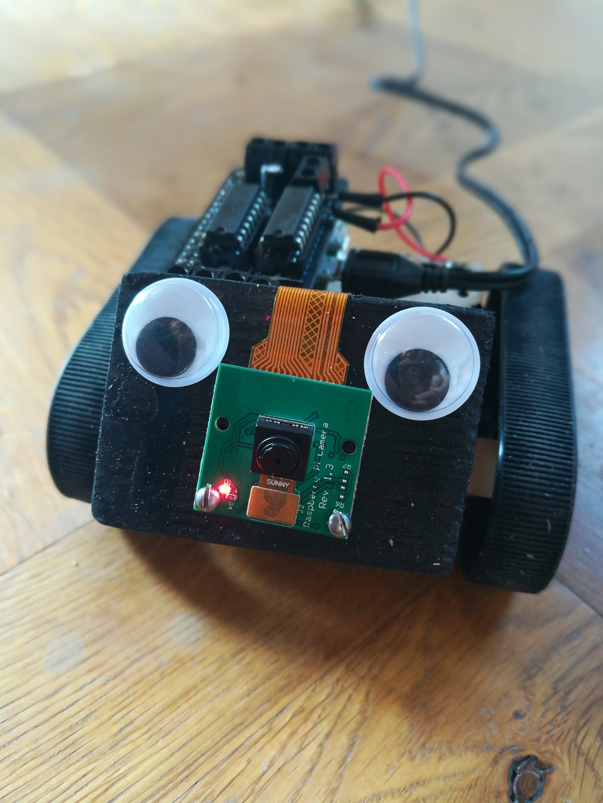

# CarZero

A small robot car with funny eyes.
Driven by a Raspberry Pi Zero and controlled via `ssh` in local wifi and camera stream in Browser.




[](https://www.youtube.com/watch?v=ZzRx71aBeUY)

## Control

1. open the video stream at
 `http://raspberrypi:8080/stream`

2. log on to RPI Zero
`
ssh -X pi@raspberrypi
`

3. run drive script
`
python drive.py
`

4. control CarZero via `arrow keys` or `WASD` while

## Hardware


* [Raspberry Pi Zero W](https://www.raspberrypi.org/products/raspberry-pi-zero-w/)
* [Camera Module v2](https://www.raspberrypi.org/products/camera-module-v2/)
* [MotoZero](https://thepihut.com/products/motozero)
* [Pololu Zumo chassis kit](https://www.pololu.com/product/1418)

## Software

### Car

`car.py` implements a `Car` class with functions `forward()`, `backward()`, `left()`, `right()` and `stop()`

on raspberry pi
```python
>>> from car import Car
>>> car = Car()
>>> car.forward()
>>> car.stop()
```

### Drive

* `drive.py`implements a key listener using the [`pynput`](https://pynput.readthedocs.io/en/latest/) package.
* The `-X` argument is required at ssh login for key listener to work.
* Motor Control via `python` using `gpiozero` package.
* Refer to  [this `Gist`](https://gist.github.com/bennuttall/20ab5f93c5f830276fdae3bf1d74cb94#file-motozero-py) for Motozero control.

### Video

Video stream realized by the [UV4L](https://www.linux-projects.org/uv4l/installation/) library.
camera configuration in `/etc/uv4l/uv4l-raspicam.conf`.
Stream accessible on browser at `http://raspberrypi:8080/stream`

Installation
```bash
curl http://www.linux-projects.org/listing/uv4l_repo/lpkey.asc | sudo apt-key add -
echo 'deb http://www.linux-projects.org/listing/uv4l_repo/raspbian/stretch stretch main' | sudo tee -a /etc/apt/sources.list
sudo apt-get update
sudo apt-get install uv4l uv4l-raspicam uv4l-raspicam-extras
sudo apt-get install uv4l-webrtc
```

## Inspiration

This project is inspired by a a video series of [Explaining Computers](https://www.youtube.com/watch?v=41IO4Qe5Jzw).
